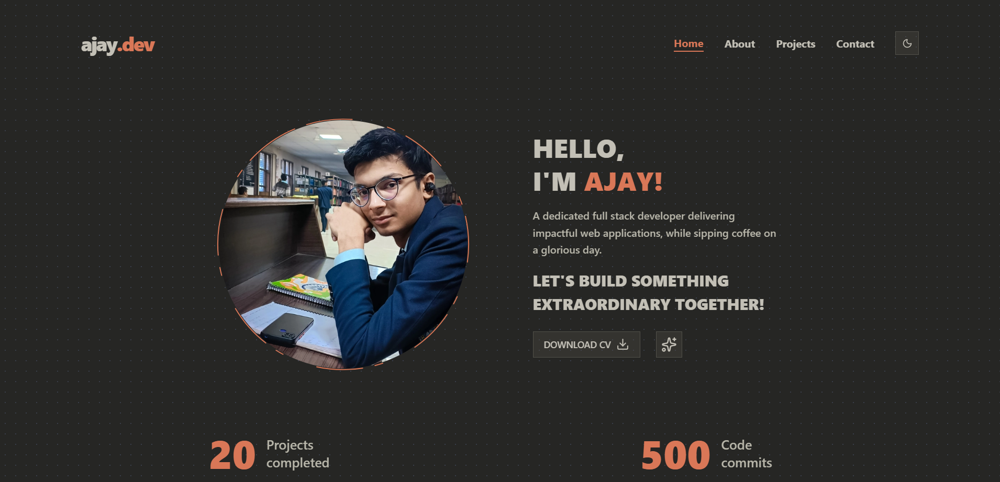

## Ajay Teotia - Developer Portfolio

Welcome to my personal **Developer Portfolio** repository!  
This website is a showcase of my projects, skills, and expertise as a modern web developer, built using **Next.js**, **React**, **Tailwind CSS**, and various powerful UI libraries.

  
_A snapshot of the portfolio homepage._

---

### 🚀 Tech Stack

- **Next.js 15**
- **React 19**
- **Tailwind CSS 4**
- **Radix UI (Dialog, Tabs, Dropdown, Tooltip, Scroll Area)**
- **Lucide Icons**
- **TypeScript**

---

### 📦 Project Setup

To run this project locally, follow these steps:

#### 1. Clone the repository

```bash
git clone https://github.com/your-username/portfolio-v2.git
cd portfolio-v2
```

### 2. Install dependencies

Make sure you have Node.js installed. Then run:

```bash
npm install
# or
yarn install
```

### 3. Start the development server

```bash
npm run dev
# or
yarn dev

```